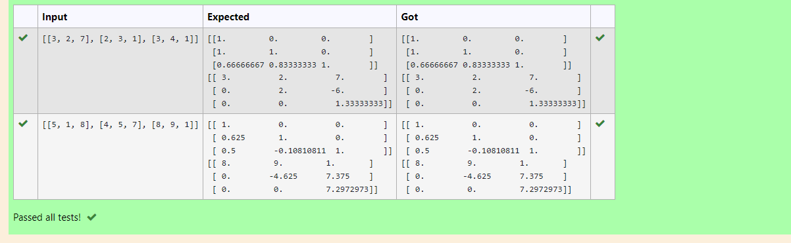
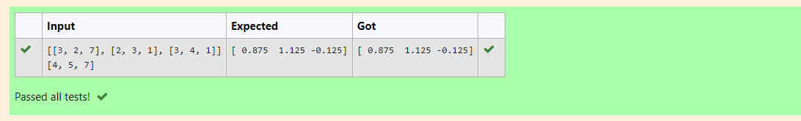

# 5(a) LU Decomposition without zero on the diagonal

## AIM:
To write a program to find the LU Decomposition of a matrix.

## Equipments Required:
1. Hardware – PCs
2. Anaconda – Python 3.7 Installation / Moodle-Code Runner

## Algorithm
1. import numpy library using import statement. 
2. From scipy package import lu().
3. Get input from user and pass it as an array.
4. Get P, L U martix using lu().
5. print L and U matrix.

## Program:
```
/*
Program to find the LU Decomposition of a matrix.
Developed by:RAJESHKANNAN.M
RegisterNumber:21500434

# To print L and U matrix
import numpy as np
from scipy. linalg import lu 
#import scoipy
#scipy.linalg.lu()
A=np.array(eval(input()))
P, L, U = lu(A)
print(L)
print(U)
*/
```

## Output:



## Result:
Thus the program to find the LU Decomposition of a matrix is written and verified using python programming.


# 5(b) LU Decomposition without zero on the diagonal

## AIM:
To write a program to find the LU Decomposition of a matrix.

## Equipments Required:
Hardware – PCs

Anaconda – Python 3.7 Installation / Moodle-Code Runner
## Algorithm
1. import numpy library using import statement.
2. From scipy package import lu_factor() and lu_solve().
3. Get two inputs from user and pass it as ,matrux array.
4. find lu and pivot value of first marix using lu_factor().
5. find solution of the matrix by using lu_solve() and pass lu, pivot values and second matrix as arguments.
6. print the solution.
##  Program:
```
/*
Program to find the LU Decomposition of a matrix.
Developed by:RAJESHKANNAN.M
RegisterNumber:21500434


# To print X matrix (solution to the equations)
import numpy as np
from scipy.linalg import lu_factor,lu_solve
A=np.array(eval(input()))
B=np.array(eval(input()))
lu, pivot = lu_factor(A)
x= lu_solve((lu,pivot),B)
print(x)
*/
```
## Output:


## Result:
Thus the program to find the solution of a matrix is written and verified using python programming.

